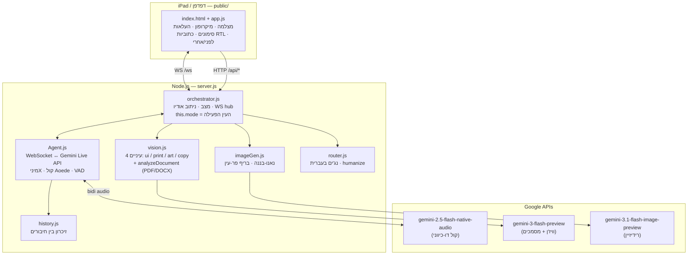

# GeminX / MiniX — ארכיטקטורה מלאה (v2.2, יולי 2026)

*המסמך העדכני והמחייב. הדיאגרמה הישנה מעידן ההאקתון: `docs/legacy-architecture-v1.md`.
ווירפריימים של כל המסכים: `docs/wireframes.html` (נפתח בדפדפן).*

---

## מה המערכת עושה — במשפט

מכוונים מצלמה (או מעלים קובץ) על עבודה — מודעת פרינט, ממשק, עבודת ארט, קמפיין כתוב —
ו**מיניX**, מבקרת קריאייטיב בקול חי, קוטלת אותה בעברית עם ראיות, מתווכחת עם מי שמגן
עליה, ובונה גרסה מתוקנת מול העיניים.

## מפת הרכיבים

## ארבע העיניים (modes)

| עין | מופעלת ע"י | מה נבדק | תוצר |
|---|---|---|---|
| `ui` | בורר / `set_mode` בקול | היררכיה, מרווחים, מטרות מגע, ניווט, קונטרסט | issues עם x/y |
| `print` | בורר / `set_mode` (ברירת מחדל) | כותרת, קופי, קלישאות, CTA, מותג, התאמת תמונה-מילים | issues עם x/y |
| `art` | בורר / `set_mode` | קומפוזיציה, סיפור צבע, זיווג פונטים, רעיון-מול-ביצוע | issues עם x/y |
| `copy` | אוטומטית בהעלאת PDF/DOCX | הבטחה, קלישאות, מקצב, מוקד-קורא, מבנה, CTA, רעיון | issues עם **ציטוטים** (בלי x/y) |

הבסיס המקצועי של העיניים (הקאנונים, כל טענה ממוקורת): `docs/critique-canon-print.md`,
`docs/critique-canon-art.md`, `docs/critique-canon-ui.md`. קול הביקורת האישי של יוסף
(מיפוי המוח + הקלטות) יזוקק לתוכם — בחתימתו בלבד.

## שלוש זרימות כניסה

1. **מצלמה (Scan):** greet → מיניX שואלת "אז מה קוטלים היום?" → `set_mode` →
   prefetch פריים ל-vision → `show_me` → lock-on עם מטרות אמיתיות → רוסט + דיבייט → Rebuild.
2. **העלאת תמונה (Upload):** התמונה הופכת למוצג (המצלמה מוסתרת), אותה זרימה בדיוק;
   התמונה שהועלתה היא ה"לפני" של הרידיזיין.
3. **העלאת מסמך (PDF/DOCX):** `/api/doc-critique` → עין copy → גיליון ציטוטים
   ("THE MATERIAL · QUOTED") במקום סימונים → רוסט קולי + דיבייט. אין Rebuild (בננה בונה תמונות).

## פרוטוקול — WebSocket `/ws`

**שרת → לקוח:**

| אירוע | תוכן | מתי |
|---|---|---|
| `init` | phase, agents | בהתחברות (מאפס מצב שרת) |
| `mini_transcript` | text | תמלול הדיבור שלה → כתוביות (וגם נאגר ל-critique) |
| `audio_chunk` | PCM16 24kHz b64 | הקול שלה |
| `flush_audio` | — | barge-in: המשתמש דיבר עליה |
| `tool_execution` | callId, tool_name, args | `annotate_at` → עיגול אדום |
| `mode_change` | mode | היא בחרה עין ב-`set_mode` |
| `vision_result` | issues, score, worst | תוצאת סריקה (וגם למסמכים) |
| `greet_done` / `agent_turn_end` | — | סיום תור דיבור |
| `build_generating` / `image_result` / `nano_banana_failed` | mime+data | צינור הרידיזיין; כשל תמיד גלוי ב-UI |
| `phase_change`, `chapter`, `credits_start`, `scene_advance`, `build_complete` | — | ניהול מצב / שרידי האקתון (הפרונט מתעלם מהלגסי) |

**לקוח → שרת:** `greet` · `show_me` · `rebuild` · `reset` · `audio_input` (PCM16 16kHz,
40ms) · `tool_completed` (ack לכל כלי) · `flush_audio` (קאט) · legacy: `phase_change`,
`advance_scene`, `go_live_manual`.

**HTTP:** `POST /api/vision-prefetch` (image+mode, מטמון ל-show_me) ·
`POST /api/vision-tick` (סריקה חיה) · `POST /api/doc-critique` (kind: pdf|docx, עד ~11MB) ·
`GET /health` (כולל mode) · `POST /api/phase` · `POST /api/clear-history`.

## כלים בידי מיניX (function calling)

| כלי | מה עושה | היכן מטופל |
|---|---|---|
| `annotate_at(x, y, label)` | עיגול עט אדום בקואורדינטות אחוז + תווית עברית | פרונט (עם ack) |
| `set_mode(mode)` | בוחרת עין אחרי שאלת הפתיחה | שרת (מאושר מיידית, משדר `mode_change`) |

*הכלים הישנים (`annotate_ui` עם מטרות ההאקתון, `render_new_ui`) פורקו ב-v2.1 — הם
הזליגו לה הקשר UI לכל סשן וייצרו סימונים חסרי משמעות.*

## אודיו — הפרטים שחשוב לא לשבור

- **כניסה:** מיקרופון → 16kHz PCM16, צ'אנקים של 40ms, gain ×4 → שרת → Live API.
  זורם **תמיד** אחרי greet (debating) — זה מה שמאפשר דיבייט ספונטני ואת תרחיש
  העימות עם ג'מיני לייב (הרמקול של ג'מיני נשמע דרך מיקרופון החדר).
- **יציאה:** 24kHz PCM16, תזמון gapless, gain ×3, החייאת AudioContext ל-iOS,
  ריקון תור ב-barge-in.
- **VAD בצד גוגל:** silenceDurationMs 300 — היא מפסיקה לדבר כשמדברים עליה.

## אילוצים והחלטות עומדות

- **Cloud Run me-west1** (פריסה ב-README) או ייבוא ל-**Google AI Studio** (עותק
  נפרד; שם המפתחות בהארד-קוד **בכוונה** — ראו חוקי הברזל ב-`docs/HANDOFF-NEXT-AI.md`;
  בריפו הזה המפתח ב-env בלבד ואסור שיהיה אחרת).
- **בלי פריימוורקים בפרונט** — HTML/CSS/JS נקי, עובד על Safari iPad.
- **עברית על הבמה** — כל שרשרת ההזנה שלה בעברית (עין, נג'ים, היסטוריה).
- **חוק הפרומפט:** `config/prompts.js` = הנשמה. טיוטות מסומנות; חתימת יוסף בלבד.
- **כישלון גלוי:** כל כשל מוצג על המסך. אסור לסמלץ את הדמות.

## נקודות הרחבה עתידיות (איפה מחברים דברים)

| רוצים... | נוגעים ב... |
|---|---|
| עין ביקורת חדשה (למשל פאקג'ינג) | `vision.js` MODES + `router.js` MODE_LABEL/ASPECTS + כפתור בבורר |
| קאנון יוסף (מיפוי המוח + הקלטות) | docs/ קובץ קאנון → זיקוק ל-`prompts.js` (בחתימה) |
| שינוי עיצוב | הכל ב-`public/index.html` (CSS משתני root) — אין build step |
| התאמת עומק הרוסט למעמד (venom dial) | פרמטר בנג' של `router.js` + כפתור — ראו `docs/ROADMAP-IDEAS.md` |
| מודלים חדשים | `config/index.js` בלבד (שמות מודלים מרוכזים שם) |

## מסמכי הבית

`docs/HANDOFF-NEXT-AI.md` (חוקי הברזל + הדלת פנימה) · `docs/session-2026-07-17-summary.md`
(עוגן v2) · `docs/copyosi-creative-corpus.md` (מי זה יוסף כיוצר) · שלושת הקאנונים ·
`docs/market-landscape.md` (מפת השוק) · `docs/LETTER-TO-MY-FUTURE-SELF.md` ·
`docs/ROADMAP-IDEAS.md` · `docs/BUILD-NOTES.md` + `docs/print-roast-adaptation.md` (היסטוריה).
